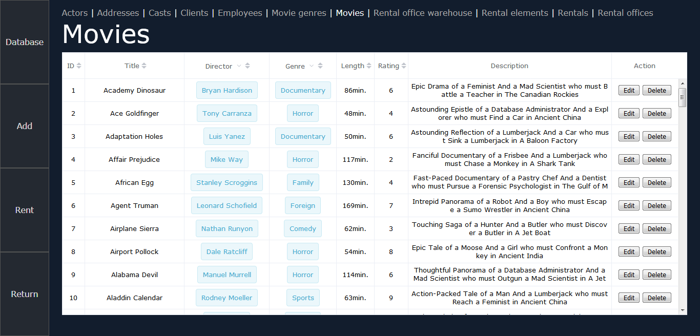
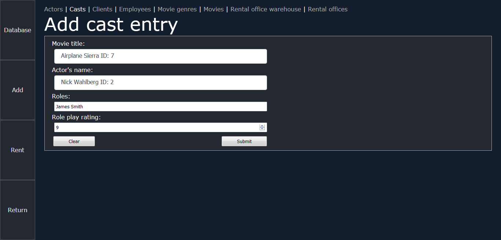
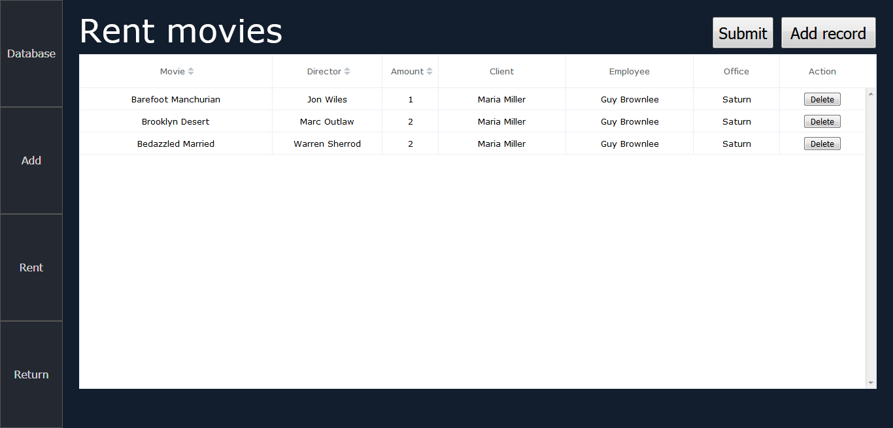
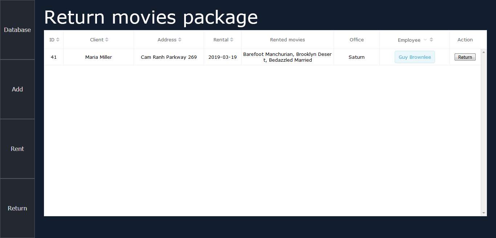
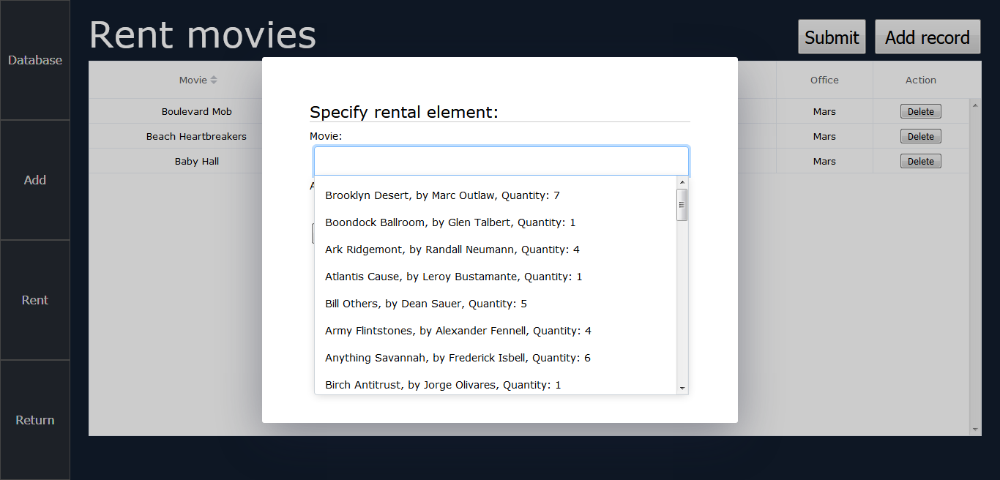

# Video Rental Offices

University project. System supporting management of video rental offices. Built using Vue.js, Spring Boot and MySQL.

## Authors:

- Bartosz Żywicki - Spring Boot, MySQL
- Tomasz Pućka - Vue.js, MySQL

## Screenshots

